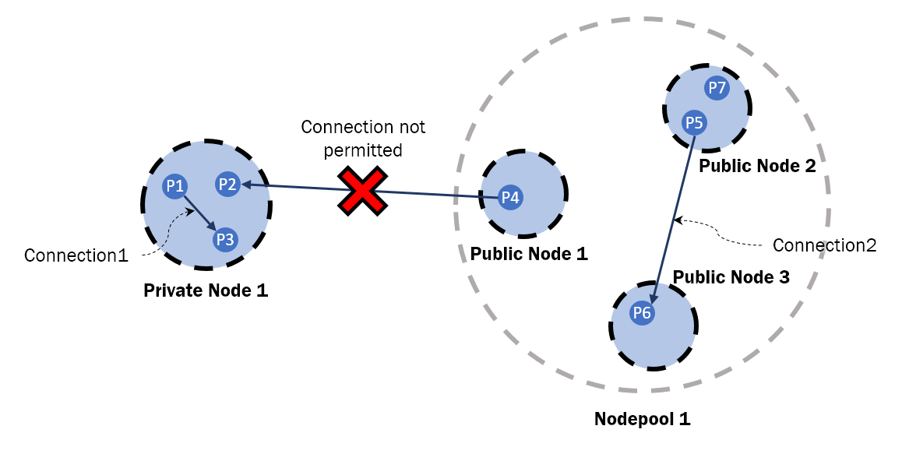

# Connections

## Introduction

Connections between two processes allow them to communicate prescribed messages between them. Such connections are only possible between either processes in the same public nodepool, or processes hosted on the same private node. It is not possible to connect a process on a private node with another in a public node.

<center>
<table class="image">
	<caption align="bottom" style="font-size: 80%;">Pic1: Permissible Connections</caption>
	<tr>
		<td>
			
		</td>
	</tr>
</table>
</center>

Connections between **RUNNING** processes are initiated by the orchestrator using either its REST interface or through its Connections UI page. Similar to a process, a connection also has a handler which the application developer is free to implement to react to various connection events as per the application's requirement. The various steps involved in establishing a connection between two processes are as follows.

## Step 1: Interface Definition

Creating a connection between processes begins with describing an interface in the respective processes' Service Descriptions (`service.json`).

```json
{
  "name": "My First Service",
  "version": "1",
  "interfaces": [
    {
      "name": "Message Interface",
      "autoConnect": false,
      "allowMultiple": true,
      "interfaceVersions": [
        {
          "versionName": "1",
          "type": "proto",
          "location": "myMessagingProtocol.proto",
          "sends": ["Msg"],
          "receives": ["Msg"]
        }
      ]
    }
  ]
}
```

The supported fields in describing an interface are:
| Field | Values | Description |
|:---:|:---:|---|
| _name_ | String | The name of the interface |
| _autoConnect_ | Boolean | Connect automatically to mirror interfaces? |
| _allowMultiple_ | Boolean | Permit more than one connections to connect to this interface? |
| _interfaceVersions_ | JSON Array | Collection of interface versions supported by this service. |

The supported fields in describing an interface version are:
| Field | Values | Description |
|:---:|:---:|---|
| _versionName_ | String | The version descriptor of the interface |
| _type_ | String (`proto`\|`xsd`) | The format in which the interface messages are defined - As [Google Protocol Buffers](https://developers.google.com/protocol-buffers/) or as [XML Schema Definition](https://www.w3schools.com/xml/schema_intro.asp)|
| _location_ | String | The name of the `.proto` or `.xsd` file with the definitions of interface messages, if it resides in the same directory as the `service.json` file. Otherwise, include path to the file in this value. |
| _sends_ | String Array| The list of names of the supported interface messages defined in the above file, outbound from the service |
| _receives_ | String Array| The list of names of the supported interface messages defined in the above file, inbound to the service |

## Step 2: Interface Message Definition
The developer can define interface messages as either Protocol Buffers or XML Schema Definitions in a file specified in the interface version description's *type* and *location* fields. Either way, the code generator will choose an appropriate compiler and create an implementation for these messages in Java or Python.

<table>
<tr>
  <th> XSD </th>
  <th> Protocol Buffer </th>
</tr>
<tr>
<td> 

```xml
<xsd:schema xmlns:xsd="http://www.w3.org/2001/XMLSchema"
            targetNamespace="urn:books"
            xmlns:bks="urn:books">

  <xsd:element name="books" type="bks:BooksForm"/>

  <xsd:complexType name="BooksForm">
    <xsd:sequence>
      <xsd:element name="book" 
                  type="bks:BookForm" 
                  minOccurs="0" 
                  maxOccurs="unbounded"/>
      </xsd:sequence>
  </xsd:complexType>

  <xsd:complexType name="BookForm">
    <xsd:sequence>
      <xsd:element name="author"   type="xsd:string"/>
      <xsd:element name="title"    type="xsd:string"/>
      <xsd:element name="genre"    type="xsd:string"/>
      <xsd:element name="price"    type="xsd:float" />
      <xsd:element name="pub_date" type="xsd:date" />
      <xsd:element name="review"   type="xsd:string"/>
    </xsd:sequence>
    <xsd:attribute name="id"   type="xsd:string"/>
  </xsd:complexType>
</xsd:schema>
```

</td>
<td>

```protobuf
message Book {
	required string id = 1;
	required string author = 2; 
	required string title = 3; 
	required string genre = 4; 
	required string price = 5; 
	required string pub_date = 6; 
	required string review = 7; 
}

message Books {
	optional repeated Book books = 1;
}
```

</td>
</tr>
<tr>
<td colspan="2">
<center>

Table 1: Comparison of an example `Books` message implemented in XSD and Protocol Buffer

</center>
</td>
</table>

Once the interface message is also defined, running the `create-service` maven plugin to generate the service stub also generates the interface messages, Connection Handler interface and the Connection Handler implementation stub. Bear in mind that running the plugin again over an implementation stub will overwrite any code that the developer wrote to extend the stub.

> _**Under the hood:**_ <br>
_The Connection Handler Java Interface is annotated with information about the messaging interface (defined by the developer in the service description). The service library uses this information to establish an matching connection and deliver the correct messages to a running process._

## Step 3: Extending the stub
Apart from an auto-generated constructor, the Connection Handler Implementation class generated by the plugin provides stub implementations of five methods:

<table>
<tr>
<th>Method</th>
<th>Description</th>
</tr>
<tr>
<td>

```java
public void handleMMessage(M message)
```
</td>
<td>This method is invoked when a message of type <b>M</b> arrives. Here <b>M</b> does not refer to a generic parameter but a message type defined by the developer in the service description. For every message supported by an interface, a <i>handleMMsg()</i> stub is generated.</td>
</tr>
<tr>
<td>

```java
public void onConnected(Connection connection)
```
</td>
<td>This method is invoked, as the name suggests, when a connection is established. The <i>Connection</i> interface parameter passed to this method can be used to respond to the process at the other end of the connection.</td>
</tr>
<tr>
<td>

```java
public void onSuspend()
```
</td>
<td>This method is invoked when a connection is suspended. Please note that this refers to the suspended state of the connection and not the process. A connection may be suspended so as to resume at a future time. For example, when a process is migrated to another node, the orchestrator suspends the process' connections along with the process itself. The orchestrator then resumes the process and its connections.</td>
</tr>
<tr>
<td>

```java
public void resumeAfterSuspend()
```
</td>
<td>This method is invoked when a connection is resumed <b>after the connection was suspended</b>. As with <i>onSuspend()</i>, this refers to the state of the connection and not the process itself.</td>
</tr>
<tr>
<td>

```java
public void onInterrupt()
```
</td>
<td>This method is invoked when the process' connection is interrupted. This could happen if the physical network is disrupted or the underlying docker networking framework fails.</td>
</tr>
<tr>
<td>

```java
public void resumeAfterInterrupt()
```
</td>
<td>Upon interruption, either the service library or the orchestrator attempts to resume the connection at a future time. This method is then invoked.
</td>
</tr>
</table>