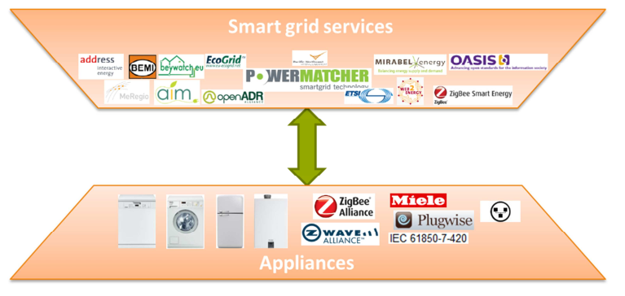

# EFI (Energy Flexiblity Interface)

The core of the dEF-Pi is the Energy Flexibility Interface (EFI). The EFI is a generic interface
which appliance manufacturers can use to describe energy flexibility, and which Smart Grid
service developers can use to describe how they want to use this flexibility. The EFI
effectively provides a common language for both sides, facilitating interoperability between
all Smart Grid services and smart appliances.

## Interoperability problem

Over the years a lot of different Smart Grid service approaches have been developed to
intelligently utilize the flexibility offered by smart appliances; appliances that can
communicate with Smart Grid services. These Smart Grid services all have their own
optimization strategies and characteristics, making them incompatible with each other. For
example, PowerMatcher is an algorithm that tries to balance energy
production and consumption in real time, where Triana is an algorithm that tries to
make plans of consumption and production in advance.

Also, there are a lot of different appliances which are able to provide flexibility such as
washing machines, heat pumps, micro-CHP’s and fridges. Each vendor has their own API
for communicating with these appliances, and there is a lot of diversity in the way these
appliances can communicate. Examples include Ethernet, ZigBee, Z-wave, Wi-Fi and PLC.
The management of all this variety on both the Smart Grid services and the app

## What is EFI?
As of yet there is no standard interface to describe and control the energy flexibility of smart devices. The Energy Flexibility Interface, for short EFI, fills this gap and is specifically designed as a standard communication method between smart devices and Demand-Side Management (DSM) solutions. EFI is developed by TNO to deal with interoperability issues encountered while experimenting and researching energy flexibility in field trials. It is a key enabling technology for the widespread deployment and adoption of Demand-Site Management to exploit energy flexibility. The interface specification of EFI is open and freely available.

Currently, there are many Demand-Side Management (DSM) solutions available that exploit the flexibility of
energy devices, such as USEF, OpenADR, Triana and TNO’s own PowerMatcher and HeatMatcher. All of these
solutions initially developed their own way to model the flexibility and communicate with the managed energy
device, resulting in many different protocols. Since there are many devices, this doesn’t scale well: device
vendors need to support many DSM solutions and DSM vendors need to support all possible devices.
Furthermore, buying one (silo) solution will create a vendor lock-in, restricting consumers in freely choosing
their DSM and device combinations. This limits the speed of adoption of exploiting flexibility, delaying the energy
transition.

EFI objectives:

* interoperability between demand response services and smart devices
* accelerating innovation by preventing DSM silo solutions / vendor lock-in
* provide a solid base for future developments of DSM solutions and/or smart devices
* simplify architectures of smart grid solutions by separation of concerns

## How does EFI work?
EFI introduces interoperability in the communication between device and DSM. TNO has thoroughly analyzed the information exchange between device and DSM and has defined four different device categories to model energy flexibility. They provide an abstraction of the devices regarding energy flexibility and are device and DSM independent. The four categories are as follows:

| Name | Description | Examples |
| --- | --- | --- |
| Inflexible | Cannot be controlled and has no actual flexibility, but is measurable and may provide forecasts | Photo-voltaic panels, domestic loads, windmills, solar collectors |
| Shiftable | Process which can be shifted in time, e.g. has a deadline | Washing machines, dryers, dishwashers |
| Adjustable | Flexible in production / consumption level and not constrained by a buffer or storage. They have a wide range of control possibilities without many restrictions and therefore usually offers a lot of flexibility. | Generators, dimmable lighting, heat pumps, gas heaters |
| Storage | Flexible in production / consumption level, but is bounded by a buffer or storage. Deadlines and required fill levels constrain the flexibility of this category. | Freezers, CHPs, thermal buffers, stationary batteries, electrical vehicles |

## EFI as common language for Energy Flexibility
EFI creates a common language for energy flexibility (as depicted in the figure below), allowing any combination of device and DSM-solution. It is designed to be future proof and only provides an abstraction of the device for modeling energy flexibility (e.g. it does not solve issues regarding home automation).

